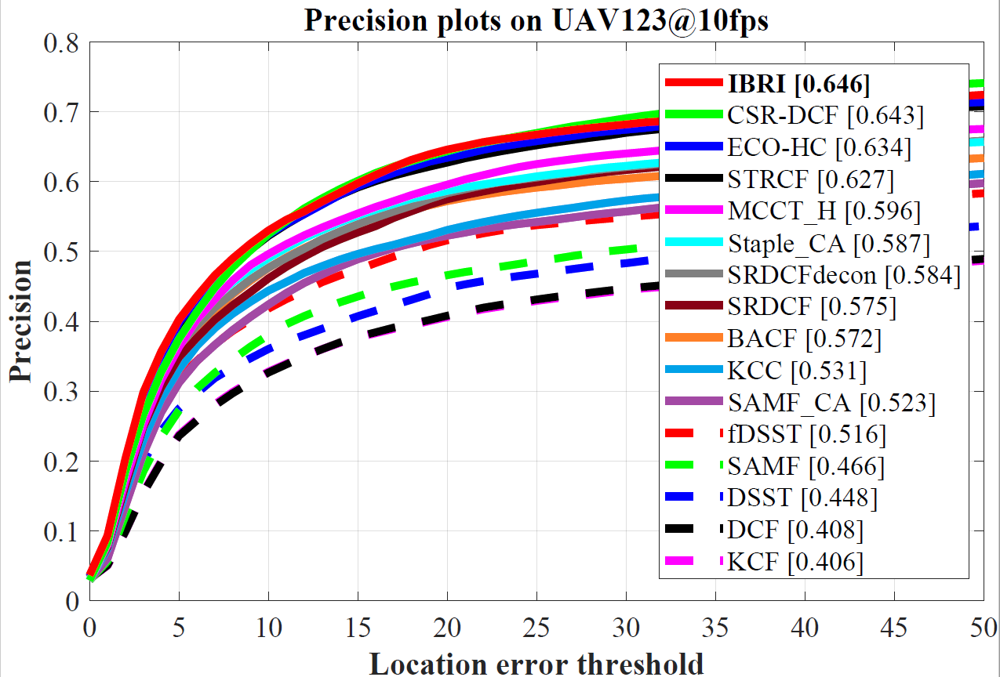
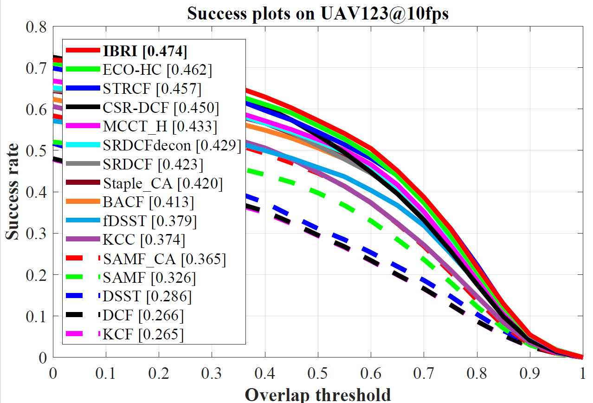
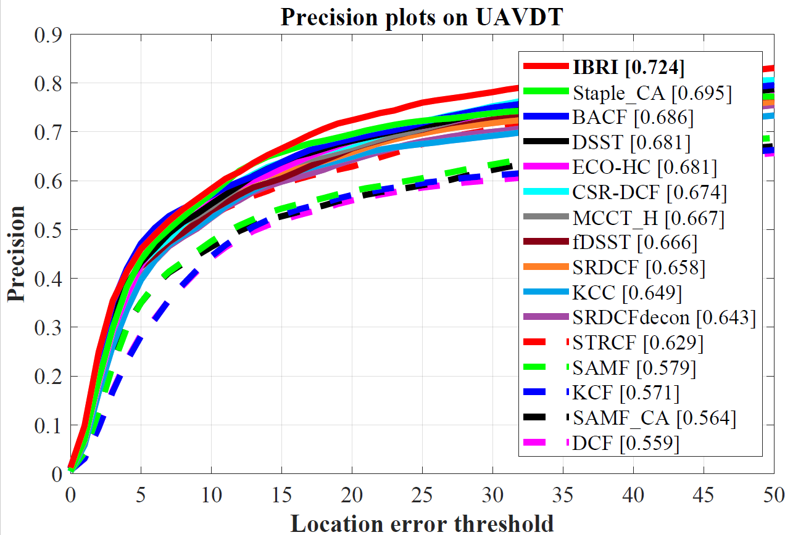
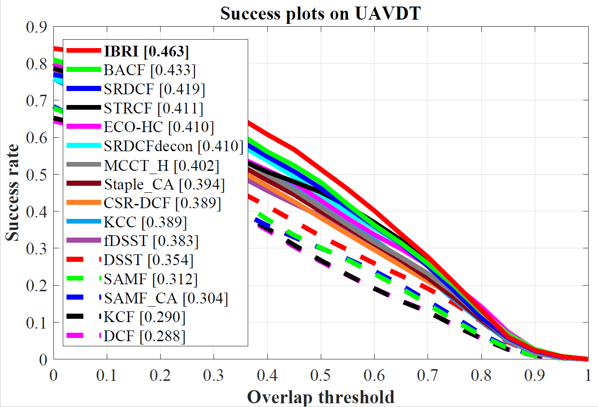
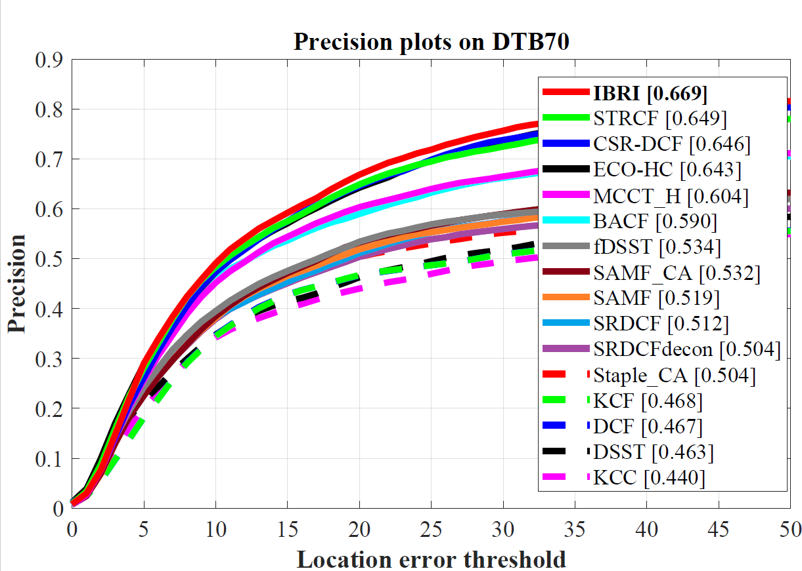
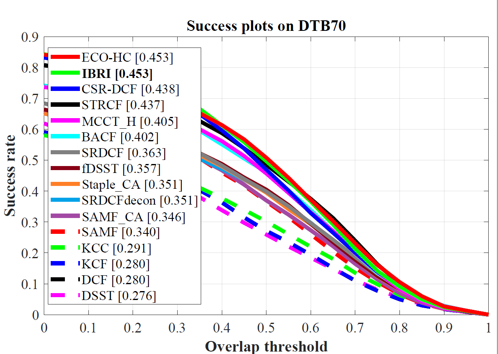

# Exploiting Interval-Based Response Inconsistency for Correlation Filters in Real-Time UAV Tracking

Matlab implementation of our Exploiting Interval-Based Response Inconsistency for Correlation Filters (IBRI) tracker.

| **Test passed**                                              |
| ------------------------------------------------------------ |
| |

# Abstract 
>Discriminative correlation filter (DCF) based tracking approaches have shown impressive performance in recent UAV-based visual object tracking applications. In the tracking process, DCFs would generate a detection response map to locate the object frame by frame. Utilizing the information on the response maps as a spatial-temporal regularizer, this work proposes a novel tracking approach to exploit interval-based response inconsistency, i.e., IBRI tracker. Specifically, it introduces inter-frame responses to the filter training process. By measuring the difference between the response of the current frame and multiple historical frames, the robustness of the proposed IBRI tracker to environment changes is enhanced. Besides, to highlight the response inconsistency of the object area and increase the effect of the central filter coefficients, a novel spatial regularizer is introduced to couple with both the temporal response inconsistency regularization term and the correlation regression term. As a result, the proposed tracker can effectively perceive the deformations of the object and suppress the misleading background noises at the same time. Comprehensive evaluations on multiple well-known benchmarks specific for UAV object tracking, i.e., UAV123, DTB70, and UAVDT, validate the robustness and accuracy of the proposed IBRI tracker against other 30 state-of-the-art trackers. The proposed tracker runs a real-time speed with 28 fps on a single CPU with competitive performance.

# Publication and citation

IBRI tracker is proposed in our paper for IROS 2020. Detailed explanation of our method can be found in the paper:

Changhong Fu, Junjie Ye, Juntao Xu and Yujie He.

Exploiting Interval-Based Response Inconsistency for Correlation Filters in Real-Time UAV Tracking

# Contact 
Changhong Fu

Email: changhong.fu@tongji.edu.cn

Junjie Ye

Email: ye.jun,jie@tongji.edu.cn

# Demonstration running instructions

Running demonstration of this tracker is very easy so long as you have MATLAB. Just download the package, extract it and follow two steps:
1. Config seq name in `configSeqs_demo_for_IBRI.m`,
2. Run `IBRI_Demo_single_seq.m`,
and the IBRI Demo should be running.

>This code is compatible with UAV123 benchmark. Therefore, if you want to run it in benchmark, just put ARCF folder in `trackers`, and config sequences and trackers according to instructions from UAV123. This should also do it.

# Results on UAV datasets

### UAV123@10fps

### UAVDT

### DTB70

# Acknowledgements

We thank the contribution of `Hamed Kiani`, `Feng Li`, Dr. `Martin Danelljan` for their previous work BACF, STRCF and ECO. The feature extraction modules are borrowed from the ECO tracker (https://github.com/martin-danelljan/ECO) and STRCF tracker (https://github.com/lifeng9472/STRCF) and some of the parameter settings and functions are borrowed from BACF (www.hamedkiani.com/bacf.html) and STRCF.

